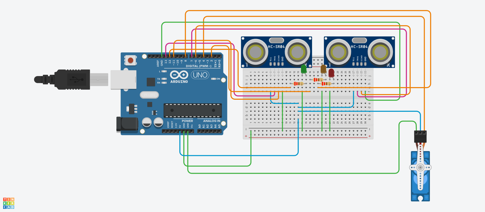

# Problem
As we age, various tasks that require back/spine maneuvers inflict more and more pain. Some tasks are so simple, that, in this day and age, there is no reason not to automate and simplify them. One of the these tasks being - trashcan opening to get rid of rubbish.

# Design
The design of the automatic trashcan is straightforward. It contains an ultrasonic sensor, which can detect and report the distance between itself and an object. When the sensor reports a short enough distance, the signal is sent to a servo motor, which rotates 90 degrees, forcing the lid open that is connected to it. When the ultrasonic sensor detects the user walking away from the trashcan, the lid automatically closes. There is a second ultrasonic sensor attached to the back of the lid, looking down into the rubbish inside the trashcan. Its purpose is to detect how close the rubbish is to the top, sending a signal to three LEDs based on the fullness of the trashcan - green (empty or almost empty), orange (half full) and red (full or almost full).

# Parts list
- 2 x Ultrasonic Distance Sensor (4-pin)
- 3 x 220 ohm resistors for LEDs
- 1 x Micro Servo motor
- 19 x jump wires
- 1 x Arduino UNO R3
- 1 x Small Breadboard

# Schematic

# Wiring

# What worked
The trashcan accomplishes exactly what it was intended to do - open when someone (or something) is in close proximity and display a fullness status with LEDs

# Future improvements
Originally, fullness status was meant to be displayed with an LCD display component, by converting distance reported by the ultrasonic sensor to percentage. It is far more intuitive and comfortable than three color LEDs. However, LCD display components require many extra spaces for pin connections, which the Arduino, given the current wiring, lacks. Therefore, an additional Arduino could be attached to the current wiring, resulting in one Arduino responsible for open/close functionality, the other - fullness status, splitting the responsibility equally. On the other hand, adding more components to a single trashcan may be unnecessary and make the trashcan needlessly bulkier and more fragile.
